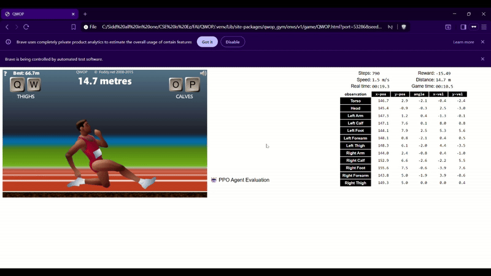

# QWOP Reinforcement Learning Project

## Motivation

[QWOP](http://www.foddy.net/Athletics.html) is a notoriously difficult browser-based game where players control a runner using only four keys (Q, W, O, P) to manipulate individual thigh and calf muscles. For human players, the controls are extremely unintuitive, espicially on our first attempts, we couldn't even properly understand what each button did, let alone coordinate them to make meaningful progress. The frustration of repeatedly face-planting within the first meter sparked an interesting question: if humans struggle so much with this task, how would a reinforcement learning agent fare?

This unique challenge made QWOP an ideal test game for our RL exploration. The game's deceptively simple objective (run 100 meters) combined with its complex, continuous physics and counterintuitive control scheme creates a rich learning environment for RL algorithms. What better way to validate our understanding of reinforcement learning than to tackle a problem where human intuition provides little advantage?

## Gymnasium Wrapper for QWOP

To train RL agents on QWOP, we leveraged the [qwop-gym](https://github.com/smanolloff/qwop-gym) wrapper, which provides a standardized Gymnasium (formerly OpenAI Gym) interface for the browser-based game. Gymnasium is the standard API for reinforcement learning environments, offering a consistent interface for agents to interact with diverse tasks—from classic control problems to complex simulations.

The qwop-gym wrapper handles the intricate details of browser automation (using ChromeDriver to control the game) and extracts rich state information from the game's physics engine. Our exploration of this wrapper, documented in [understanding_QWOP_gym.ipynb](My-RL/understanding_QWOP_gym.ipynb), revealed its key features:

**Environment Access:**
- Automated browser control of the QWOP game
- Real-time state extraction via ChromeDriver
- Comprehensive observation space including position, velocity and angle of 12 different body parts

**Action Space:**
- 16 discrete actions representing all possible combinations of Q, W, O, and P key presses
- Allows the agent to control thigh and calf muscles independently

**Default Reward Function:**
- Reward = (distance traveled / time elapsed) - time penalty
- Encourages forward progress while penalizing time spent
- While simple, this reward function proved insufficient for learning proper running mechanics (more on this later)

## Proximal Policy Optimization (PPO)

### Why PPO?

We chose Proximal Policy Optimization, an actor-critic policy gradient method, as our primary approach for several reasons:
- **Continuous State Space:** QWOP's observation space includes continuous values (positions, velocities, angles of body parts)
- **Discrete Action Space:** Despite the continuous physics, our actions are discrete (16 combinations of key presses)
- **Sample Efficiency:** PPO's clipped objective function prevents destructively large policy updates, leading to more stable learning
- **Proven Track Record:** PPO has demonstrated strong performance on complex continuous control tasks

### Implementation Journey

**Baseline Implementation with Stable-Baselines3:**

We initially implemented PPO using the Stable-Baselines3 library (see [playground.ipynb](My-RL/playground.ipynb)). The agent showed promising behavior and learned basic forward movement strategies. You can see an early result in [showcase.ipynb](My-RL/showcase.ipynb).

**Training Paradigm Shift: Episodes → Steps:**

During training, we encountered a important insight. Training for a fixed number of episodes proved inefficient because QWOP is highly failure-prone. Many episodes ended within seconds, providing minimal learning signal. Hence we shifted to training for a fixed number of steps instead, where each step represents a single state-action-reward transition. This approach provided a much more direct and consistent measure of learning progress, as every step contributed equally to the training data regardless of episode length.

**Custom PPO Implementation:**

Building on theoretical foundations from our coursework, we implemented our own PPO algorithm from scratch (check out [train_ppo.py](My-RL/train_ppo.py)). This custom implementation **successfully trained an agent that consistently reaches the finish line**! You can watch it in action below:

[](https://youtu.be/VlHlnPoo1eE)

*Note: While our custom PPO outperformed the Stable-Baselines3 version, this is likely because we trained it for significantly more steps. Both implementations are theoretically sound!*

## Double QN
Not done yet

## Deep QN 
Not done yet

## The "Knee Scraping" Problem

### What is Knee Scraping?

One of the fascinating/frustrating emergent behaviors in QWOP RL is the "knee scraping" or "crawling" strategy. Instead of learning to run upright like a human, many RL agents discover a peculiar but effective technique: they crawl forward on their knees, scraping along the ground to inch their way to the 100-meter finish line.


While this strategy is technically successful (it does complete the game), it's:
- **Extremely slow:** Taking several steps to finish what could be done in faste with proper strides
- **Not the intended solution:** The agent exploits the physics engine rather than learning biomechanically correct running
- **Universally observed:** Almost every QWOP RL project we studied ([this implementation](https://github.com/juanto121/qwop-ai), [this Medium article](https://medium.com/data-science/achieving-human-level-performance-in-qwop-using-reinforcement-learning-and-imitation-learning-81b0a9bbac96), and numerous others) reported the same phenomenon.

### Why Does This Happen?

The default reward function `(distance / time) - time_penalty` encourages forward progress but doesn't explicitly reward proper running form or penalize ungainly movement. From the agent's perspective, knee scraping is a **locally optimal solution**: it's stable, consistent, and virtually eliminates the risk of falling backward. The agent discovers that staying low to the ground provides stability, even if it sacrifices speed.

### Our Challenge

How do we encourage the agent to learn proper striding mechanics rather than settling for this crawling behavior? This question drove our subsequent experimentation with reward shaping and custom reward functions.

## Reward Shaping: Penalizing Low Torso Height

### Initial Approach

Our attempt at "patching" the knee scraping problem was straightforward: **penalize the agent when its torso drops too low**. We modified the reward function to include a penalty proportional to how far below a threshold the torso's y-coordinate fell, implemented as:

```
penalty = ReLU(threshold - torso_y)
modified_reward = default_reward - penalty
```

This seemed logical: if the agent gets penalized for having a low torso, it should learn to stay upright and run properly, right?

### The Mixed Result



The torso penalty did accomplish one thing: **the agen atleast tried to keeping its torso elevated**. However, this created new problems:

- **Early Terminations:** The agent became overly conservative, often falling or failing within the first meter trying to maintain an upright posture
- **Poor Starting Strategy:** Without stable initial movements, the agent struggled to establish forward momentum
- **Missing the Core Issue:** While the agent stood taller (sometimes), it still hadn't learned the coordinated alternate movement of limbs necessary for striding. 

### Key Insight

This experiment revealed an important lesson in reward shaping: **straightforward penalties can create new failure modes rather than solving the underlying problem**. Is there a more elegant reward system to make the agent stride?

## Custom Rewards
The above modification in the reward was a "patch" and did not go deep into understanding how the existing reward system works and if we could engineer a better reward system to encourage the model to stride. We noticed that the environment provided us with a lot off information which was not being used to its full potential. Hence we tried some custom reward functions!
-Still to do

## Future Directions

### Imitation Learning: Learning from Human Demonstrations

We could not deal with the knee scraping problem. However we are not disappointed with our implementation as the knee scraping problem has proven remarkably persistent across the QWOP RL community. Almost every project we studied—from [academic implementations](https://github.com/juanto121/qwop-ai) to [detailed blog posts](https://medium.com/data-science/achieving-human-level-performance-in-qwop-using-reinforcement-learning-and-imitation-learning-81b0a9bbac96) encountered this same challenge. Many found success by extending to **imitation learning**, where the agent learns from human gameplay demonstrations rather than discovering strategies purely through trial and error. 

This approach has been historically proven effective numerous times:
- **AlphaGo** famously used supervised learning on human expert games before refining its strategy through self-play
- **Robotics** applications often bootstrap policies from human demonstrations to avoid dangerous exploration
- **QWOP specifically**: Several successful implementations showed that agents initialized with human demonstrations learned proper striding mechanics much faster than purely RL-based approaches

### Potential Next Steps

Learning about and incorporating imitation learning is a promising direction. We believe that the general direction to improve this project is as follows:

1. **Record human demonstrations** of successful QWOP runs
2. **Pre-train the policy network** using behavioral cloning on these demonstrations to establish a baseline of "proper" running
3. **Fine-tune with RL** to optimize performance beyond human-level play while maintaining the learned striding mechanics

By combining the strengths of both paradigms: human intuition about biomechanics and RL's optimization power, we hope to train agents that not only complete QWOP efficiently but do so in a way that resembles actual running rather than emergent exploits of the physics engine.